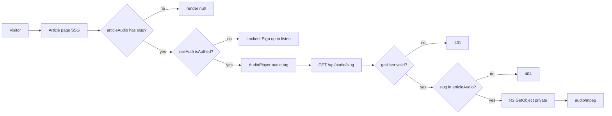

# Article Audio — System Architecture

Feature: a single-narrator (voice `af_heart`) audio player on every article, with authenticated streaming from a private bucket and spoken diagram descriptions. Plan: `/Users/kelex/.hermes/plans/2026-09-14_232914-audio-article-player.md`. Arch contract types: `src/lib/audio/contracts.ts`.

## Stack

- Next.js 16.3.4 App Router (repo `adroit-site-copy`). Route handler for streaming; SSG article pages mount the player.
- Cloudflare R2 (PRIVATE bucket `adroit-audio`, reached over its S3 API through `src/lib/r2/client.ts`) for MP3 blobs — the READ store. The Supabase Storage `audio` bucket is the GENERATION-SIDE SOURCE bucket only: `scripts/build-audio.js` uploads there and `scripts/migrate-audio-to-r2.cjs` mirrors each object to the same key in R2, so a rollback stays a config revert rather than a restore. Audio never enters git (repo size + Vercel Deployment Storage metering).
- Kokoro-82M TTS (default engine), swappable CLI (Edge TTS alternate). Runs on the Fortress Mac, not the server.
- Vitest 4 + Testing Library (mirror existing `src/**/*.test.ts(x)`).

## Component map

- `AudioPlayer` (new, client, `src/components/BlogPost/AudioPlayer.tsx`) — renders three states from `audio + isAuthed`:
  1. no `ArticleAudio` for slug → `null`.
  2. logged-out (`!isAuthed`) → compact locked card, "Sign up to listen", NO `<audio>`.
  3. signed-in → native `<audio controls src={/api/audio/<slug>}>` + 1x/1.25x/1.5x speed select, `aria-label="Article audio player"`.
  - Auth resolved via existing `useAuth()` hook (`src/lib/hooks/useAuth.ts`, `user !== null` after `!isLoading`), not a prop.
- `MDXArticle` / `Figure` (existing) — markdown `alt` is the accessible diagram description the narration reads (AC-2 source). No Figure change required.
- Article page `src/app/field-notes/[slug]/page.tsx` (existing SSG) — mount `<AudioPlayer slug={post.slug} audio={articleAudio.find(a => a.slug === post.slug)} />` just above the `<article className="article-body …">` block.

## Data & API

- `src/data/audio.ts` (generated by `scripts/build-audio.js`) — `import { ArticleAudio } from "@/lib/audio/contracts"`; `export const articleAudio: ArticleAudio[]`. Build-time static, safe in a client component (no `fs`).
- `src/lib/audio-narration.ts` — pure `mdxToNarration(mdx, opts?)` used by BOTH `build-audio.js` (Node import) and its Vitest test (DRY, mirrors `build-posts.js`).
- `scripts/tts/**` — `synthesize.py --engine kokoro|edge --voice af_heart --out out.mp3`; `engines/kokoro.py` and `engines/edge.py`. Missing engine fails the run (no fabricated mp3).
- `GET /api/audio/[slug]` — dynamic route handler (the read path).
- `GET /api/audio/[slug]/timings` — same auth gate and the same server-side R2 read for the segment-timing manifest; absent manifest → 404 and the client drops follow-along.

### Route semantics (AC-1)

| Condition | Status | Body / headers |
|---|---|---|
| Unknown slug (absent from `articleAudio`) | 404 | no body |
| Authenticated + object retrievable | 200 | `audio/mpeg`, `Cache-Control: private, max-age=3600` |
| Unauthenticated / invalid session | 401 | no body |

Flow: `getSupabaseServerClient().auth.getUser()` → 401 if no user → resolve `storagePath` from `articleAudio` → 404 if absent → `getR2Object(storagePath)` (`src/lib/r2/client.ts`, an S3 GetObject against the private R2 bucket `adroit-audio`, bucket-scoped credentials, path-style addressing, region `auto`) → stream the bytes back as fixed `audio/mpeg`. The object is fetched INSIDE the handler and never leaves the server as a URL: NO public URL and NO signed URL is ever emitted, as a fallback included. `getR2Object` returns `null` for a missing key (→ 404) and throws on any other failure (→ the handler fails closed to 401). NEVER `storage.getPublicUrl`.

### Storage key scheme (AC-1)

Both stores use the same bucket-relative key layout, which is why the storage migration needed no change to `src/data/audio.ts`.
`AudioStorageKey = "blog/<slug>/<voice>.mp3"` — e.g. `blog/agent-eval-infrastructure-2026/af_heart.mp3`.
The key resolves against the PRIVATE Cloudflare R2 bucket `adroit-audio` (env `R2_BUCKET`) on the read path, and against the PRIVATE Supabase `audio` source bucket (`AUDIO_BUCKET`, `"public": false`) on the generation/write path. Neither store is publicly readable: objects are only ever fetched server-side by the authed route.

## Data flow

client `<audio src="/api/audio/agent-eval…">` → route handler → cookie session check (`getSupabaseServerClient`) → articleAudio lookup → server-side R2 read (`getR2Object`, private `adroit-audio`) → `audio/mpeg` bytes → native player. Logged-out visitor hits the locked card; the fetch only happens once authenticated. No public URL and no signed URL exists at any hop (AC-4).

## ADRs

| ID | Title | Decision | Alternatives | Consequences |
|----|-------|----------|--------------|--------------|
| ADR-001 | Private bucket + authed route over public bucket | Private R2 bucket `adroit-audio`, read server-side by `GET /api/audio/[slug]` | Public bucket; public or signed URL | Auth gate preserved; server must stream; ~1MB responses well under Vercel function limit |
| ADR-002 | Kokoro-82M default, single narrator | Engine CLI dispatch, voice `af_heart` | Edge TTS, ElevenLabs | No live cloning; one pass per article; on-brand consistent voice |
| ADR-003 | Alt text is the spoken diagram source | Narration reads Figure `alt`; optional `description::` override | Rewrite content | No content rewrite for pilot; terse alt yields thin narration |
| ADR-004 | Generated `src/data/audio.ts` | Script → static module (like `posts.ts`/`learn.ts`) | DB query at request time | Zero runtime IO for the SSG page; rebuild to refresh |
| ADR-005 | Cloudflare R2 over Supabase Storage for blobs | Read objects from the private R2 bucket `adroit-audio` (S3 API, bucket-scoped keys); Supabase `audio` stays the generation-side source bucket | Keep serving from Supabase (Free tier bills storage + 1 GB egress); public R2 bucket + URL | 10 GB with zero egress fees; rollback is a config revert; generator must mirror to R2 until it writes there directly |

## Non-goals / explicit cut

- No visitor voice selector (single narrator, locked `af_heart`).
- No backfill beyond the 5 most recent articles in the pilot (separate follow-up).
- No public audio URL, no signed audio URL, no open bucket.
- No audio in git (MP3 lives in R2, mirrored in the Supabase source bucket; `*.mp3` gitignored).

## Handoff to Kara (designer)

AudioPlayer locked state needs a compact on-brand card ("Listen free with an account"), dark-mode via `var(--surface-card)` etc., and a native-player speed menu. Figure/alt text unchanged.
