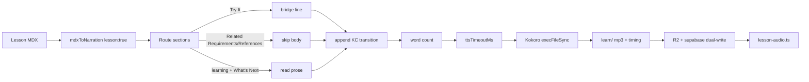

# Lesson Audio Refinements — Smart Narration + TTS Timeout Scaling

Feature: two refinements to the already-merged lesson-audio scaffolding
(`feat/lesson-audio` is on main; learn mode + `lesson-audio.ts` + player are
live). Brainiac designs only (no implementation). Steel implements on
`feat/lesson-audio-refinements`; QA is Zod; this is NOT merged to main.

Scope of changed files (all expected): `src/lib/audio-narration.ts`,
`src/lib/audio/contracts.ts`, `scripts/build-audio.js`, the narration test
suite, and these docs.

---

## 1. Problem analysis

### 1a. Smart narration: what the current builder does

`mdxToNarration` (`src/lib/audio-narration.ts`) is a pure, line-based MDX -> prose
converter shared by the blog (article) path and the learn (lesson) path. For a
lesson it treats the MDX exactly like an article: every heading becomes
`Section: <heading>.`, every `` becomes `Diagram: <alt>.`, and every
body line is flattened to prose. That means a lesson currently reads EVERY
section aloud, including:

- `## Try It` hands-on step-by-steps (a listener cannot act while listening)
- `## Related Requirements` (a requirements/link list)
- `## References` (the citation block)

...and it never ends with a hand-off to the knowledge check, even though the
quiz is a real, separate surface (`questions/<slug>.json` + `exam.json`) the
listener is expected to visit next.

### 1b. Structural truth across the catalogue (verified, not assumed)

The catalogue is **240 lessons across 9 series**. They fall into **two families**:

**Family A - "Atlas/cert-trail" (54 lessons), fixed skeleton:**
omni-studio-cert (40), salesforce-data-architect (7),
salesforce-sharing-visibility-architect (7).

```
Deep Dive -> [Worked example] -> Configuration Walkthrough -> Exam Traps
  -> Try It -> What's Next -> Related Requirements -> References
```

**Family B - "consultant/architect" (186 lessons), open concept layout:**
agentic-ai (45), ai-at-work (30), hermes-consultant (23),
hermes-consultant-intermediate (23), hermes-consultant-advanced (20),
salesforce-architect (45).

```
(intro) -> <many varied concept sections> -> Worked example -> The pitfall(s)
  -> Try It -> What's Next
```

The key asymmetry that drives the design:

- The **interactive sections to CUT** are a tiny, stable, closed set:
  `Try It` (variant: `Try it:` + subtitle), `Related Requirements`,
  `References`. 100% of lessons that carry them use the same normalized text,
  and `Try It` is ALWAYS a level-2 (`##`) heading.
- The **learning sections to KEEP** are the huge, varied set (hundreds of
  unique heading texts: Deep Dive, Worked example, Define the terms, Exam tip,
  ...). Enumerating a learning allowlist would be fragile.

**Therefore: invert.** Use a small *interactive heading allowlist* and treat
everything else as learning content by default. This is the robust design the
task asked for: we only ever need to enumerate the finite set of sections a
listener cannot act on, not all 240 lessons' varied learning headings.

### 1c. TTS timeout: the generator kills long lessons

`scripts/build-audio.js` calls the Kokoro engine through `execFileSync` with a
rigid `timeout: 120000` (both the blog synthesizer and the learn
`runLearn` synthesizer). Kokoro-82M on the Fortress Mac synthesizes in roughly
real time; a lesson runs up to **~5.7k words** (measured max
`day-06-p-3b-...-field.mdx` = 5,713 words), roughly 2-3x an article, and the
engine is hard-killed at exactly 120s. It works fine standalone on short text;
the model is cached. The rigid constant is the bug.

---

## 2. Design

### 2a. Smart narration — architecture

Extend the pure `mdxToNarration` with an opt-in **lesson mode** so the article
path is byte-for-byte unchanged (no regression to the 52 audio tests). Lesson
mode changes only the *section routing*; the existing diagram lead-in
(`Diagram: <alt>.`), syntax stripping, and footnote handling are untouched.

**New option shape on `NarrationOverrides` / the contract `NarrationOptions`:**

```ts
lesson?: boolean;                    // lesson-aware routing; articles omit this
tryItBridge?: string;                // spoken line that replaces Try It body
knowledgeCheckTransition?: string;   // closing KC hand-off, appended last
```

**Section classifier (normalized heading text -> routing):**

```ts
const isTryIt     = /^try it([:\s]|$)/i;         // "Try It", "Try it: <X>"
const exactEqual  = (s) => (set) => set.has(s.toLowerCase());
// INTERACTIVE (skip body -> bridge or nothing):  try it, related requirements, references
// Everything else -> LEARNING (read normally)
```

Matching is on the **normalized heading text** (trim + lowercase + collapse
whitespace), not raw heading, and applies to the section the heading opens. The
pure function tracks one small state: the heading level at which an interactive
section began, so nested `###`/`####` steps inside `Try It` are skipped too and
reading resumes cleanly at the next section boundary.

**Routing table (lesson mode only):**

| Heading (normalized)            | Action                                             |
|---------------------------------|----------------------------------------------------|
| `try it`, `try it: <subtitle>`  | Emit `tryItBridge` once, skip section body         |
| `related requirements`          | Skip section body (nothing emitted)                |
| `references`                    | Skip section body (nothing emitted)                |
| `what's next`                   | READ normally (recap + next-lesson preview)        |
| anything else                   | READ normally (learning content)                   |

`What's Next` is deliberately READ, not skipped: it is the recap and preview a
listener benefits from, and it is the last section in both families, so the
knowledge-check transition lands cleanly after it.

**The closing transition (spoken copy, appended LAST, exactly once, lesson mode
only, only if learning content was emitted):**

> "That's the lesson. When you're ready, return to the lesson page to complete
> the knowledge check and test what you've heard."

Draft for Chris to refine. No em-dashes. It is appended as the final line of
the narration, after all learning content (and `What's Next`), never inside a
skipped/quiz section.

**Why this is robust across 240 lessons:** we only enumerate the interactive
set ({Try It / Related Requirements / References}), which is closed and stable.
Verification scan across all 240 lessons showed ZERO false positives on the
normalized exact/prefix matchers, and the two near-miss headings that contain
the words ("Spotting invented references", "The try-it: run your own
extraction loop") do NOT match because the matcher is anchored to the heading
start. Family A and Family B both simply "cut Try It (+ Related Requirements /
References when present), read the rest, append KC transition".

### 2b. TTS timeout scaling — architecture

Replace the rigid `120000` with a length-scaled timeout computed from the
**narration word count** (post-`mdxToNarration`), in `scripts/build-audio.js`:

```js
const TTS_TIMEOUT = {
  baseMs: 30_000,      // engine/model load + first-chunk latency
  perWordMs: 90,       // generous; measured Kokoro realtime ~30-50ms/word => ~2-3x headroom
  ceilingMs: 900_000,  // 15 min hard cap: a real hang still dies
};
function ttsTimeoutMs(narration) {
  const words = narration.trim().split(/\s+/).filter(Boolean).length;
  return Math.min(TTS_TIMEOUT.baseMs + words * TTS_TIMEOUT.perWordMs, TTS_TIMEOUT.ceilingMs);
}
```

- **5,713-word max lesson:** 30s + 5713*90ms = ~544s (~9 min), **well inside the
  15-min ceiling** and far past the old 120s wall.
- **Typical ~2k-word article:** 30s + 2000*90ms = ~210s — comfortably over the
  old 120s, so long articles stop flirting with the wall too.
- **Hang protection retained:** the 15-min ceiling means a genuinely stuck
  engine still gets killed; scaling never removes the guard, it only raises it
  proportionally to the input. A future pathological 10k-word input would cap
  at 15 min instead of failing outright.

Use the same helper for BOTH the blog synthesizer and the learn
`runLearn` synthesizer (same engine, same failure mode).

---

## 3. Data flow

Generation (offline, Fortress Mac):

```
lesson MDX -> mdxToNarration(raw, { lesson: true })
  -> learning prose (Try It replaced by bridge, KC transition appended)
  -> word count -> ttsTimeoutMs(narration) -> Kokoro execFileSync(timeout)
  -> learn/<series>/<slug>/<voice>.mp3 + .timing.json
  -> R2 (verify by re-read) + Supabase dual-write -> src/data/lesson-audio.ts
```

Playback (unchanged): authed `GET /api/audio/<slug>` reads the private R2
object with the existing fail-closed 401/404 + members-only access gate. No
public or signed URL at any hop.



---

## 4. ADRs

| ADR | Title | Decision | Alternatives | Consequences |
|-----|-------|----------|--------------|--------------|
| ADR-106 | Interactive-heading ALLOWLIST over learning-heading blacklist | Route sections in lesson mode by a tiny allowlist of interactive headings (`Try It`, `Related Requirements`, `References`); everything else is learning by default | Fixed heading blacklist of all learning headings; paragraph-heuristic detection | Only the finite interactive set must ever be enumerated; survives all 240 lessons + future concept-heading variation; one code path |
| ADR-107 | Read `What's Next`, append KC transition last | `What's Next` is spoken as recap/preview; the knowledge-check transition is appended once as the final line (lesson mode) | Cut `What's Next` too; inject transition mid-content | Listener gets the recap + a clean, terminal KC hand-off in both families |
| ADR-108 | Length-scaled TTS timeout (base + words*rate, 15-min ceiling) | `ttsTimeoutMs` replaces the rigid 120s in build-audio.js for both synthesizers | Keep 120s (kills lessons); remove timeout (no hang guard) | Long lessons never hit a wall; real hangs still killed by the ceiling |

Supersedes nothing previously locked; ADR-105 ("reuse mdxToNarration unchanged")
is revised to "reuse mdxToNarration with an opt-in lesson option" — still ONE
pure function, no fork.

---

## 5. Exact code changes for Steel

### 5a. `src/lib/audio-narration.ts`

1. Extend `NarrationOverrides` with `lesson?: boolean`,
   `tryItBridge?: string`, `knowledgeCheckTransition?: string`.
2. Add module constants for defaults:
   - `DEFAULT_TRY_IT_BRIDGE = "This lesson includes a hands-on exercise you can do in your sandbox."`
   - `DEFAULT_KC_TRANSITION = "That's the lesson. When you're ready, return to the lesson page to complete the knowledge check and test what you've heard."`
3. In `mdxToNarration`, when `opts.lesson` is truthy, gate section routing on
   the normalized heading text:
   - `Try It` (match `/^try it([:\s]|$)/i`): emit `tryItBridge` once, then skip
     every subsequent line until the next heading at level <= the Try It
     heading's level.
   - `related requirements` / `references` (exact lowercase match): skip the
     section body the same way, emit nothing.
   - Track `skipLevel` (the level of the interactive heading); while inside a
     skipped section, drop paragraphs, diagrams, footnote definitions, and
     deeper headings; clear when a heading with level <= skipLevel arrives and
     route that heading normally (so `What's Next` is read).
   - Do NOT emit `Section: ...` for the three interactive headings.
4. After the loop, if `opts.lesson` and the output is non-empty, append the
   KC transition once.
5. Article mode: `opts.lesson` falsy -> existing behaviour (defaults preserved,
   so the 52 audio tests and blog path are untouched).

### 5b. `src/lib/audio/contracts.ts` (brainiac-owned — implement per this doc)

Mirror the three new `NarrationOptions` fields so the contract stays the source
of truth. Do not change existing fields.

### 5c. `scripts/build-audio.js`

1. Add `ttsTimeoutMs(narration)` + `TTS_TIMEOUT` constants (used by both
   synthesizers).
2. `runLearn` calls `mdxToNarration(raw, { lesson: true })`.
3. Replace `{ timeout: 120000, ... }` with
   `{ timeout: ttsTimeoutMs(narration), ... }` in BOTH the blog and learn
   synthesizer `execFileSync` calls.
4. Blog article path still calls `mdxToNarration(raw)` with no lesson option
   (no narration change), only the timeout now scales.

### 5d. Tests

Add lesson-mode cases to `src/lib/audio-narration.test.ts`:
- `## Try It` body is replaced by the bridge and its steps are not read.
- `## Related Requirements` + `## References` bodies are not read.
- `## Exam Traps` and `## What's Next` ARE read.
- A `## Try it: <subtitle>` variant is matched (subtitle case).
- The KC transition appears exactly once as the last line in lesson mode.
- Article mode output is unchanged from pre-refinement (regression guard).
- No em-dashes in any new prose.

---

## 6. Acceptance criteria (verifiable)

- `npx vitest run src/lib/audio-narration.test.ts, src/lib/audio-emit.test.ts, audio/*, atlas/*` -> all pass (52+38 audio/atlas).
- `tsc --noEmit` clean; `npm run build` + lint pass.
- Running `mdxToNarration(raw, { lesson: true })` on
  `content/learn/salesforce-sharing-visibility-architect/day-01-p-1a-object-permissions-crud-system-vs-object-profiles.mdx`:
  - learning content (Deep Dive, Worked example, Configuration Walkthrough,
    Exam Traps) IS read;
  - `## Try It` steps body NOT read (one bridge line instead);
  - `## Related Requirements` and `## References` NOT read;
  - all 5 `Diagram: <alt>.` descriptions read;
  - ends with the KC transition;
  - zero leaked syntax (`#`, `*`, backtick, `<`, `>`, raw `</diagrams/`).
- `scripts/build-audio.js` synthesizes the max ~5.7k-word lesson without the
  120s wall (timeout computes to ~9 min, engine finishes).
- Commit to `feat/lesson-audio-refinements` only. Do NOT push to main.

---

## 7. Handoff

- **Steel** implements 5a-5d and verifies 6 on `feat/lesson-audio-refinements`.
- **Kara** — no new visual design is required (narration is audio-only; player
  unchanged). Confirm the locked-card copy reads correctly in a lesson context
  if desired; otherwise a no-op.
- **Chris** to review the closing-transition + bridge spoken copy (drafts above
  are placeholders he may refine; keep them em-dash-free).
- **QA (Zod)** on completion.

## Non-goals / explicit cut

- No change to the article-audio narration or `src/data/audio.ts`.
- No new audio route, no player change, no abridge of `What's Next`.
- No change to quiz JSON; the knowledge-check transition only *points* at the
  existing quiz.
- No timeout change in `scripts/truncate-audio-sources.js` (separate tool, not
  the generator); it may follow the same formula later if needed.