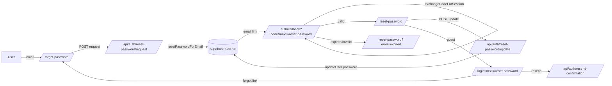

# Password Reset + Signup Recovery — Architecture

Tenant: adroit-blog · Author: Brainiac (Arch) · Date: 2026-08-31
Sources: BA t_e9f1eb58 (`requirements-password-reset.md`), plan `~/.hermes/plans/2026-08-31_password-reset.md`
Downstream: Design (kara t_64d4c246) → Build (steel t_e25638b3) → A11y+QA+Security → Deploy (alpha)

## Stack
Next.js 16 App Router + TypeScript, Supabase email/password auth via server-cookie sessions.
All new routes use the existing SSR client (`getSupabaseServerClient`) — the browser never
talks to Supabase directly for session state. No new deps, no new env vars, no schema changes.

## Route table
| Route | Method | Purpose | Auth |
|-------|--------|---------|------|
| `/api/auth/reset-password/request` | POST | `resetPasswordForEmail`; generic non-enumerating response; rate-limited | guest |
| `/auth/callback` | GET | `exchangeCodeForSession(code)`; sanitized redirect to `next` (default `/reset-password`) | guest→session |
| `/reset-password` | page | auth-gated; new password → update route; success + expired states | session |
| `/api/auth/reset-password/update` | POST | `updateUser({ password })`, min 6; 401 if guest | session |
| `/forgot-password` | page | email entry → request route → generic confirmation | guest |
| `/api/auth/resend-confirmation` | POST | `resend({ type:'signup', email })` (US-6); generic + rate-limited | guest |
| `/login` | page+API | extend: forgot link (signin), friendly unconfirmed error (US-5), resend action (US-6), explicit `redirectTo` on signUp (AC-6.3) | guest |

## Component map
- `/forgot-password` — client form (email, mono kicker, navy/red tokens from `/login`), inline validation,
  generic confirmation state, aria-live status. New server layout for noindex metadata.
- `/reset-password` — client page. Reads `error` query param (expired/invalid → "request a new link" state),
  else auth-gated password form (new + confirm, min 6, mismatch inline error), success state. New server layout (noindex).
- `/login` — add forgot-password link (signin mode only, preserves no `next` — decided drop), render friendly
  unconfirmed-email error as `role=alert`, resend action button in that state.
- Reused as-is: `Header`, `Footer`, `useAuth` hook + `notifyAuthChanged`, `buildMetadata` (noindex).

## Data & API
- No data entities. All state lives in Supabase auth (users, recovery tokens, sessions).
- All auth-email calls (reset, resend, and existing signUp) pass an explicit `redirectTo` built by
  `src/lib/auth-emails.ts` — the single code-level guard against a repeat of the natalie incident (AC-6.3).
  Default origin: `siteConfig.url` (`https://adroit.io`, matches Supabase `site_url` + `uri_allow_list`).

## Contracts
Full TS contracts in `src/shared/contracts.ts` (generated from the decomposition-plan comment; compile under `tsc --strict`):
- Route/page constants: `ROUTE_RESET_REQUEST`, `ROUTE_RESET_UPDATE`, `ROUTE_RESEND_CONFIRMATION`,
  `ROUTE_AUTH_CALLBACK`, `PAGE_LOGIN`, `PAGE_FORGOT_PASSWORD`, `PAGE_RESET_PASSWORD`.
- API payloads/results: `ResetRequestPayload`, `ResetRequestResult`, `ResetUpdatePayload`, `ResetUpdateResult`,
  `ResendConfirmationPayload`, `ResendConfirmationResult`.
- Callback surface: `AuthCallbackQuery`, `CallbackErrorKind` (`expired|invalid`), `CALLBACK_ERROR_PARAM`, `CALLBACK_NEXT_PARAM`.
- `AUTH_ORIGIN` canonical constant; `AuthRedirectBuilder` type implemented by the backend.

## Diagram

## Implementation phases (mapped to Build card t_e25638b3)
- **Phase A — backend**: `src/lib/auth-emails.ts` (redirect builder), request/update/resend routes,
  `/auth/callback` route, extend login route (US-5 error map + signUp redirectTo), route tests.
- **Phase B — frontend**: `/forgot-password` + layout, `/reset-password` + layout, login-page forgot link +
  unconfirmed error + resend action, page tests.
- Phase B depends on Phase A for the contracts and the E2E reset path. Both share one project root.

## ADRs
- **ADR-PWR-1 (redirect origin).** Every auth-email `redirectTo` = `<siteConfig.url>/auth/callback?next=…`.
  Context: Supabase `uri_allow_list` = [adroit.io, www.adroit.io, adroit-blog.vercel.app]; `site_url` = adroit.io.
  Decision: hard-code `AUTH_ORIGIN = siteConfig.url`, never derive from request host (avoids allowlist-mismatch
  rejection). Consequences: works today; if the live deploy that must serve the callback is NOT adroit.io,
  that origin MUST be added to `uri_allow_list` and `AUTH_ORIGIN` updated, else reset links 404 (natalie repeat).
- **ADR-PWR-2 (drop `next` through reset).** Forgot link is plain `/forgot-password`; after reset land on `/blog`.
  Context: BA open question 1 (AC-4.4). Decision: drop `next` propagation through the reset flow. Consequence:
  one fewer CWE-601 surface; callback still sanitizes its own `next` (AC-2.3) since `redirectTo` always passes
  `next=/reset-password`.
- **ADR-PWR-3 (callback error surface).** Expired/used code → redirect `/reset-password?error=expired`;
  missing/garbage code → `/reset-password?error=invalid`. Both render the "request a new link" state. Context:
  BA open question 3. Decision: keep the user on the reset page. Consequence: one route to build, no `resent` flag.
- **ADR-PWR-4 (resend placement).** Resend confirmation lives only in the login unconfirmed-email error state via
  a new `POST /api/auth/resend-confirmation`. Context: BA open question 2. Decision: login error state only
  (less surface). Consequence: forgot-password page stays minimal.

## Risks
1. **High — deploy-origin mismatch (natalie repeat).** The email callback must resolve on the origin used as
   `redirectTo`. `checkOrigin`'s allowlist names `adroit-blog-two.vercel.app` as the live deploy, but that is
   NOT in the Supabase `uri_allow_list`. Build must verify `https://adroit.io/auth/callback?next=/reset-password`
   serves the app in prod; if it 404s, add the real origin to `uri_allow_list` and set `AUTH_ORIGIN` to it.
   This is the single most important pre-deploy verification.
2. **Proxy.ts interplay (AC-2.6).** Proxy runs `getUser()` on `/auth/callback` (non-api) before the handler.
   For a guest clicking a reset link there is no prior session, so proxy passes through and the handler's
   `exchangeCodeForSession` cookie write is final. Build must add a test asserting the callback's
   `sb-<ref>-auth-token` Set-Cookie is present and correct.
3. **Rate limiter is per-process.** Accepted (Vercel), documented in api-security.ts. Enumeration-safe generic
   responses on the limiter reject too (AC-1.5).
4. **User enumeration.** request + resend return identical messages for known/unknown emails; failures surface
   as generic success with server-side logging only (AC-1.2/1.7/6.2).

## Verification (Build card)
- `npm run build` + `npm run lint` pass, 0 errors/warnings.
- Tests: request route (enumeration-safe, validation, rate limit), callback (valid/invalid/expired/missing code,
  malicious `next`), update route (guest 401, min-6), auth-emails redirect builder.
- E2E: reset with valid code → session → new password → old password no longer signs in.
